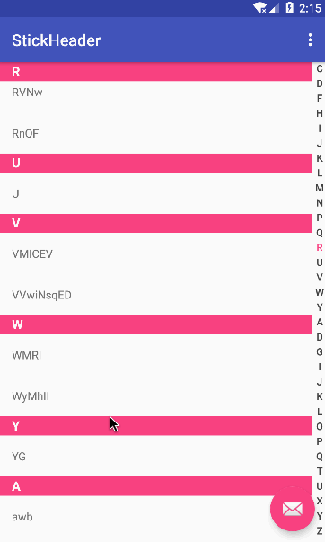

# Stick Header ItemDecoration


#### Preview



#### fir.im
[](https://fir.im/stickyHeaderByZeno)

#### Usage

```
repositeries{
  maven{ url "http://maven.mjtown.cn/" }
}

dependencies{
  compile "name.zeno:sticky-header:1.0.0"
}
```


```java
public class MainActivity extends AppcompatActivity{
  private List<String> items;
  
  private void init(){
    rcvContent.addItemDecoration(new StickyHeaderDecoration(position -> 
        items.get(position).toUpperCase().substring(0, 1)));
        
    sideBar.setupWithRecycler(rcvContent, position -> {
      if (items.size() > 0 && items.size() > position) {
        return items.get(position).substring(0, 1).toUpperCase();
      } else {
        return "";
      }
    });
  }
}
```

## HOW TO HELP ME

- 有 BUG 尽管往 issues 里上！
- 有功能扩展往 pull requests 里上！
- 给个 star！
- 请我喝瓶矿泉水？

